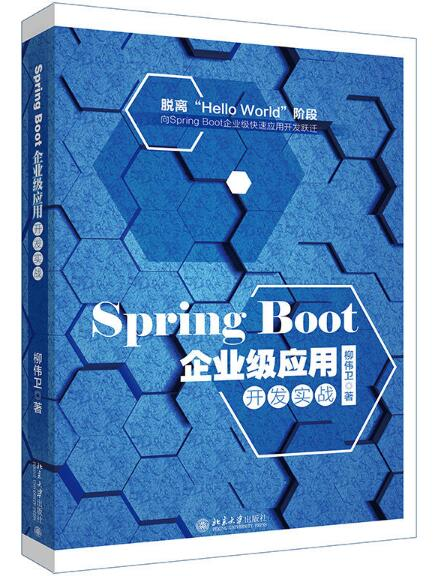

# 《Spring Boot 企业级应用开发实战》源码

## 内容简介

本书围绕如何整合以目前最新的 Spring Boot 2 版本为核心的技术栈，来实现一个完整的企业级博客系统而展开。读者可以通过学习构建这个博客系统的整个过程，来达到设计和实现一个企业级 Java EE 应用开发的目的。该博客系统是一个类似于 WordPress 的专注于博客功能的博客平台，支持多用户访问和使用。该博客系统所涉及的相关技术有 Spring Boot、Spring、Spring MVC、Spring Security 、Spring Data、Hibernate、Gradle、Bootstrap、jQuery、HTML5、JavaScript、CSS、Thymeleaf、MySQL、H2、Elasticsearch、MongoDB 等，技术点较为丰富，内容富有前瞻性。

本书面向实战，除了给出基本的原理外，会辅以大量的案例和源码，利于读者理论联系实践。全书对于技术讲解的安排，是按照渐进式的教学方式来进行的。按照学习的难度，大致可以分为实战入门阶段、实战进阶阶段、实战高级阶段三个部分，内容包括Spring Boot 概述、Spring 框架核心概念、Spring MVC 及常用MediaType、集成 Thymeleaf、数据持久化、全文搜索、架构设计与分层、集成Bootstrap、博客系统的需求分析与设计、集成Spring Security、博客系统的整体框架实现、用户管理实现、角色管理实现、权限管理实现、文件服务器实现、博客管理实现、评论管理实现、点赞管理实现、分类管理实现、标签管理实现、首页搜索实现等。

本书主要面向的用户是 Java 开发者，以及对 Spring Boot 及企业级开发感兴趣并有一定了解的读者。

## 写作背景

对于 Spring Boot 知识的整理归纳，最早是在笔者的第一本书[《分布式系统常用技术及案例分析》](https://github.com/waylau/spring-boot-enterprise-application-development)
的微服务章节中，作为微服务的技术实现方式来展开的。由于篇幅限制，当时讲解的案例深度和广度也
比较有限。其后，笔者又在 GitHub 上，以开源方式撰写了[《Spring Boot 教程》](https://github.com/waylau/spring-boot-tutorial)系列课程 ，为网友们提
供了更加丰富的使用案例。在 2017 年年初，笔者应邀给慕课网做了一个关于 Spring Boot 实战的系列[视频课程](http://coding.imooc.com/class/125.html) 。视频课程上线后受到了广大的 Spring Boot 技术爱好者的关注，课程的内容也引发了热烈的反响。很多该课程的学员，通过学习该课程，不但技术能力提高了，而且在如何采用新技术来实现企业级应用上有了更深刻的理解，最重要的是提升了自己在市场上的价值。

鉴于 Spring Boot 技术人才在社会上的需求依然很旺盛，而市面上有关 Spring Boot 学习资料，大多
停留在“Hello World”级别的案例，缺乏使用 Spring Boot 来构建完整企业级应用实战的能力。故笔者将以往系列课程中的技术做了总结和归纳，采用目前最新的 Spring Boot 2 技术来重新编写了整个教学案例，整理成书，希望能够弥补 Spring Boot 在实战方面的空白，使广大 Spring Boot 爱好者都能受益。

## 目录

见全书[目录](SUMMARY.md)。

## 本书所涉及到的技术及相关版本如下

本书所采用的技术及相关版本较新，请读者将相关开发环境设置成跟本书所采用的一致，或者不低于本书所列的配置。

* JDK 8
* Gradle 4.0
* Eclipse Oxygen Release (4.7.0)：本书示例采用 Eclipse 编写，但示例源码与具体的 IDE 无关，读者朋友可以自行选择适合自己的 IDE，比如 IntelliJ IDEA、NetBeans 等。
* Spring Boot 2.0.0.M2
* Spring 5.0.0.RC2
* Thymeleaf 3.0.6.RELEASE
* Thymeleaf Layout Dialect 2.2.2
* MySQL Community Server 5.7.17
* MySQL Workbench 6.3.9
* Spring Data JPA 2.0.0.M4
* Hibernate 5.2.10.Final
* MySQL Connector/J 6.0.5
* H2 Database 1.4.196
* Elasticsearch 5.5.0
* Spring Data Elasticsearch 3.0.0.M4
* Tether 1.4.0 :<http://tether.io/>
* Bootstrap v4.0.0-alpha.6 : <https://v4-alpha.getbootstrap.com/>
* jQuery 3.1.1 : <http://jquery.com/download/>
* Font Awesome 4.7.0 :<http://fontawesome.io>
* NProgress 0.2.0 :<http://ricostacruz.com/nprogress/>
* Thinker-md :<http://git.oschina.net/benhail/thinker-md>
* jQuery Tags Input 1.3.6 : <http://xoxco.com/projects/code/tagsinput/>
* Bootstrap Chosen 1.0.3 :<https://github.com/haubek/bootstrap4c-chosen>
* toastr 2.1.1 :<http://www.toastrjs.com/> 
* Spring Security 5.0.0.M2
* Thymeleaf Spring Security 3.0.2.RELEASE
* Apache Commons Lang 3.6
* Markdown parser for the JVM 0.16  
* MongoDB 3.4.6
* Spring Data Mongodb 2.0.0.M4
* Embedded MongoDB 2.0.0
* IK Analysis for Elasticsearch 5.5.0

## 源代码

本书提供源代码下载，地址位于[本项目](https://github.com/waylau/spring-boot-enterprise-application-development)下的`samples`目录。

## 勘误和交流

本书如有勘误，会在<https://github.com/waylau/spring-boot-enterprise-application-development/issues>上进行发布。由于笔者能力有限，时间仓促，难免错漏，欢迎读者批评指正。

您也可以上[豆瓣](https://book.douban.com/subject/30192752/)给老卫打Call。

## 联系作者

您也可以直接联系我：

* 博客：https://waylau.com
* 邮箱：[waylau521(at)gmail.com](mailto:waylau521@gmail.com)
* 微博：http://weibo.com/waylau521
* 开源：https://github.com/waylau

## 如何获取本书

实体店及各大网店有售。据我所知有如下网站供应：

* [京东](https://search.jd.com/Search?keyword=%E6%9F%B3%E4%BC%9F%E5%8D%AB%20Spring%20Boot%20%E4%BC%81%E4%B8%9A%E7%BA%A7%E5%BA%94%E7%94%A8%E5%BC%80%E5%8F%91%E5%AE%9E%E6%88%98&enc=utf-8&wq=%E6%9F%B3%E4%BC%9F%E5%8D%AB%20Spring%20Boot%20%E4%BC%81%E4%B8%9A%E7%BA%A7%E5%BA%94%E7%94%A8%E5%BC%80%E5%8F%91%E5%AE%9E%E6%88%98&pvid=19da8cbcfabd40e4b89ec0fdfeb5fd59)
* [1号店](https://search.yhd.com/c0-0/k%25E6%259F%25B3%25E4%25BC%259F%25E5%258D%25AB%2520Spring%2520Boot%25E4%25BC%2581%25E4%25B8%259A%25E7%25BA%25A7%25E5%25BA%2594%25E7%2594%25A8%25E5%25BC%2580%25E5%258F%2591%25E5%25AE%259E%25E6%2588%2598/)
* [淘宝](https://s.taobao.com/search?q=%E6%9F%B3%E4%BC%9F%E5%8D%AB+Spring+Boot+%E4%BC%81%E4%B8%9A%E7%BA%A7%E5%BA%94%E7%94%A8%E5%BC%80%E5%8F%91%E5%AE%9E%E6%88%98&imgfile=&js=1&stats_click=search_radio_all%3A1&initiative_id=staobaoz_20180830&ie=utf8)
* [当当](http://search.dangdang.com/?key=%C1%F8%CE%B0%CE%C0%20Spring%20Boot%20%C6%F3%D2%B5%BC%B6%D3%A6%D3%C3%BF%AA%B7%A2%CA%B5%D5%BD&act=input)
* [亚马逊](https://www.amazon.cn/s/ref=nb_sb_noss?__mk_zh_CN=%E4%BA%9A%E9%A9%AC%E9%80%8A%E7%BD%91%E7%AB%99&url=search-alias%3Daps&field-keywords=%E6%9F%B3%E4%BC%9F%E5%8D%AB+Spring+Boot+%E4%BC%81%E4%B8%9A%E7%BA%A7%E5%BA%94%E7%94%A8%E5%BC%80%E5%8F%91%E5%AE%9E%E6%88%98&rh=i%3Aaps%2Ck%3A%E6%9F%B3%E4%BC%9F%E5%8D%AB+Spring+Boot+%E4%BC%81%E4%B8%9A%E7%BA%A7%E5%BA%94%E7%94%A8%E5%BC%80%E5%8F%91%E5%AE%9E%E6%88%98)

也可以直接关注我博客（<https://waylau.com>）或者我的开源书（<https://waylau.com/books>）。

## 其他书籍

若您对本书不感冒，笔者还写了其他方面的超过一打的书籍（可见<https://waylau.com/books/>），多是开源电子书。

本人也维护了一个[books-collection](https://github.com/waylau/books-collection)项目，里面提供了优质的专门给程序员的开源、免费图书集合。

## 开源捐赠

捐赠所得所有款项将用于开源事业！见[捐赠列表](https://waylau.com/donate)。

